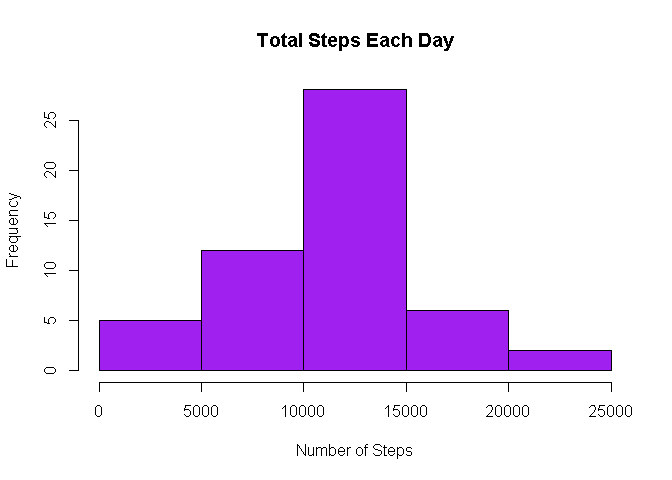
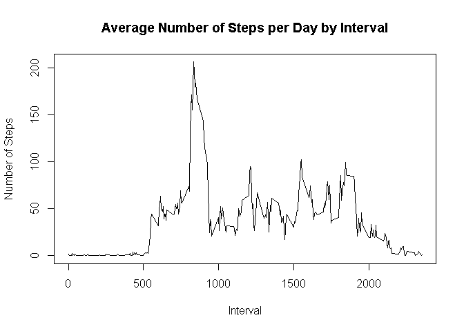
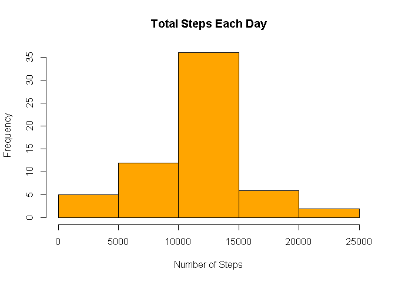
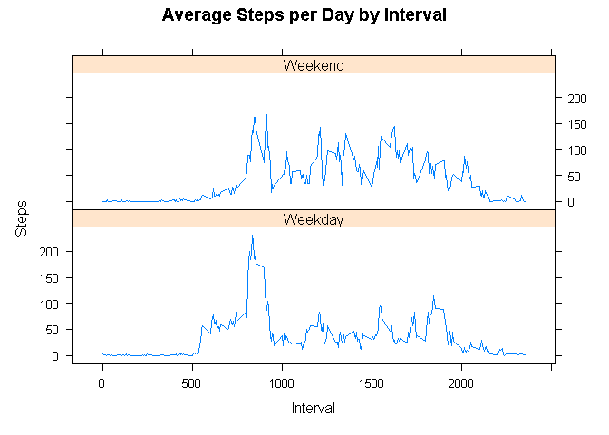

# Reproducible Research - Analyzing Activity Monitoring Device Data

## Introduction

It is now possible to collect a large amount of data about personal movement using activity monitoring devices such as a Fitbit, Nike Fuelband, or Jawbone Up. These type of devices are part of the “quantified self” movement – a group of enthusiasts who take measurements about themselves regularly to improve their health, to find patterns in their behavior, or because they are tech geeks. But this data remains under-utilized because the raw data is hard to obtain and there are limited tools and statistical methods available for interpreting the data. This assignment makes use of data from a personal activity monitoring device. This device collects data at 5 minute intervals through out the day. The data consists of two months of data from an anonymous individual collected during the months of October and November, 2012 and include the number of steps taken in 5 minute intervals each day.  

## Data

The data for this assignment can be downloaded from the course web site: Dataset: Activity monitoring data [52K] The variables included in this dataset are: steps: Number of steps taking in a 5-minute interval (missing values are coded as NA) date: The date on which the measurement was taken in YYYY-MM-DD format interval: Identifier for the 5-minute interval in which measurement was taken The dataset is stored in a comma-separated-value (CSV) file and there are a total of 17,568 observations in this dataset.  


***  
**First lets load in our required libraries**

```r
library(ggplot2)
library(dplyr)
```

```
## Warning: package 'dplyr' was built under R version 4.1.1
```

```
## 
## Attaching package: 'dplyr'
```

```
## The following objects are masked from 'package:stats':
## 
##     filter, lag
```

```
## The following objects are masked from 'package:base':
## 
##     intersect, setdiff, setequal, union
```

```r
library(lattice)
```

***
**Now lets read in our data. The data for this assignment can be downloaded from the course web site directly in R. However, for this assignment i have saved a copy in my local repository **


```r
activity_data <- read.csv("activity.csv")  
```

***

## Question 1 - What is mean total number of steps taken per day?

1. Calculate the total number of steps taken per day
2. Make a histogram of the total number of steps taken each day
3. Calculate and report the mean and median of the total number of steps taken per day

***


```r
## 1. Aggregate (sum) the data by date and steps

steps_by_day <- aggregate(steps ~ date, activity_data, sum)

## 2. Create a historgram to diisplay the total number of steps by each day.
hist(steps_by_day$steps, main = paste("Total Steps Each Day"), col="purple",xlab="Number of Steps")
```

<!-- -->

```r
## 3.a Calculate the mean
mean_steps <- mean(steps_by_day$steps)
mean_steps
```

```
## [1] 10766.19
```

```r
## 3.b Calculate the median
median_steps <- median(steps_by_day$steps)
median_steps
```

```
## [1] 10765
```
***

The mean is **10766.19** and the median is **10765**

***

## Question 2 - What is the average daily activity pattern?

1. Make a time series plot (i.e. type = "l") of the 5-minute interval (x-axis) and the average number of steps taken, averaged across all days (y-axis)
2. Which 5-minute interval, on average across all the days in the dataset, contains the maximum number of steps?


```r
## Aggregate (mean) the data by Steps and interval
steps_interval <- aggregate(steps ~ interval, activity_data, mean)

## 1. Plot the Average Number Steps per Day by its Interval
plot(steps_interval$interval,steps_interval$steps, type="l", xlab="Interval", ylab="Number of Steps",main="Average Number of Steps per Day by Interval")
```

<!-- -->

```r
## 2. Establish the interval with the most number of steps
most_steps <- steps_interval[which.max(steps_interval$steps),1]
most_steps
```

```
## [1] 835
```

***
        
The interval with most steps is **835**

***

## Question 3 - imputing missing values


1. Calculate and report the total number of missing values in the dataset (i.e. the total number of rows with NAs)


```r
## 1. Calculate number of missing values
Total_NAs <- sum(!complete.cases(activity_data))
Total_NAs
```

```
## [1] 2304
```

The total number of missing values in our dataset is **2304**

***

2. Devise a strategy for filling in all of the missing values in the dataset. The strategy does not need to be sophisticated. For example, you could use the mean/median for that day, or the mean for that 5-minute interval, etc.


```r
## 2. I used the mean average steps per interval to compute the missing data

Steps_Average <- aggregate(steps ~ interval, data = activity_data, FUN = mean)
impute_NA <- numeric()
for (i in 1:nrow(activity_data)) {
    observation <- activity_data[i, ]
    if (is.na(observation$steps)) {
        steps <- subset(Steps_Average, interval == observation$interval)$steps
    } else {
        steps <- observation$steps
    }
    impute_NA<- c(impute_NA, steps)
}
```
***

3. Create a new dataset that is equal to the original dataset but with the missing data filled in.


```r
impute_activity <- activity_data
impute_activity$steps <- impute_NA

head(impute_activity)
```

```
##       steps       date interval
## 1 1.7169811 2012-10-01        0
## 2 0.3396226 2012-10-01        5
## 3 0.1320755 2012-10-01       10
## 4 0.1509434 2012-10-01       15
## 5 0.0754717 2012-10-01       20
## 6 2.0943396 2012-10-01       25
```
***


4.Make a histogram of the total number of steps taken each day and Calculate and report the mean and median total number of steps taken per day. Do these values differ from the estimates from the first part of the assignment? What is the impact of imputing missing data on the estimates of the total daily number of steps?


```r
new_total_steps<- aggregate(steps ~ date, data = impute_activity, sum, na.rm = TRUE)
hist(new_total_steps$steps, main = paste("Total Steps Each Day"), col="orange", xlab="Number of Steps")
```

<!-- -->

***

**Calculate Mean**

```r
new_mean_Steps <- mean(new_total_steps$steps)
new_mean_Steps
```

```
## [1] 10766.19
```

***

**Calculate Median**

```r
new_median_steps <- median(new_total_steps$steps)
new_median_steps
```

```
## [1] 10766.19
```

***

**Do these values differ from the estimates from the first part of the assignment?**


```r
## Calculate the mean difference
mean_step_diff <- mean_steps - new_mean_Steps
mean_step_diff
```

```
## [1] 0
```

```r
## Calculate the median difference
median_step_diff <- median_steps - new_median_steps
median_step_diff
```

```
## [1] -1.188679
```

***

The mean variance is 0 and has not changed. However the median does differ slightly with our imputed values included. This is to be expected with the increase in number of values evaluated.

***

**What is the impact of imputing missing data on the estimates of the total daily number of steps?**

The impact of the missing data has the biggest effect on the 10000 - 150000 step interval and changes frequency from 27.5 to 35 a variance of 7.5


***
## Question 4 - Are there differences in activity patterns between weekdays and weekends?


For this part the weekdays() function may be of some help here. Use the dataset with the filled-in missing values for this part.

1. Create a new factor variable in the dataset with two levels – “weekday” and “weekend” indicating whether a given date is a weekday or weekend day.

2. Make a panel plot containing a time series plot (i.e.type = "l") of the 5-minute interval (x-axis) and the average number of steps taken, averaged across all weekday days or weekend days (y-axis). 


```r
weekdays <- c("Monday", "Tuesday", "Wednesday", "Thursday", 
              "Friday")
impute_activity$dow = as.factor(ifelse(is.element(weekdays(as.Date(impute_activity$date)),weekdays), "Weekday", "Weekend"))
new_total_steps <- aggregate(steps ~ interval + dow, impute_activity, mean)

xyplot(new_total_steps$steps ~ new_total_steps$interval|new_total_steps$dow, main="Average Steps per Day by Interval",xlab="Interval", ylab="Steps",layout=c(1,2), type="l")
```

<!-- -->
***

The plot highlights that There is a higher peak of step frequency earlier on in weekdays but there is  more overall activity on a weekend.

